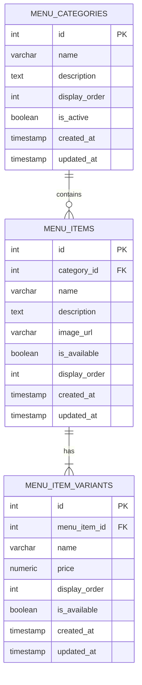

# Menu Database Schema

## Overview

This document defines the initial database schema for the Georgio's Online Ordering menu system.

The schema supports:

* Menu categories
* Menu items
* Item variants such as sizes
* Different prices for each variant
* Item availability
* Display ordering
* Future modifier support such as toppings and add-ons

---

## Menu Categories

The `menu_categories` table represents the main sections of the menu.

Examples:

* Pizza
* Roast Beef
* Hot Subs
* Cold Subs
* Salads
* Side Orders
* Drinks

### Table: `menu_categories`

| Column          | Type      | Constraints            | Description                                  |
| --------------- | --------- | ---------------------- | -------------------------------------------- |
| `id`            | INTEGER   | PRIMARY KEY            | Unique category identifier                   |
| `name`          | VARCHAR   | NOT NULL, UNIQUE       | Category name                                |
| `description`   | TEXT      | NULLABLE               | Optional category description                |
| `display_order` | INTEGER   | NOT NULL               | Controls category display order              |
| `is_active`     | BOOLEAN   | NOT NULL, DEFAULT TRUE | Determines whether the category is displayed |
| `created_at`    | TIMESTAMP | NOT NULL               | Creation timestamp                           |
| `updated_at`    | TIMESTAMP | NOT NULL               | Last update timestamp                        |

---

## Menu Items

The `menu_items` table represents individual food and drink items.

Examples:

* Cheese Pizza
* Super Beef
* Italian Sub
* Caesar Salad

Prices are not stored directly on menu items because many items have multiple sizes with different prices.

### Table: `menu_items`

| Column          | Type      | Constraints            | Description                                |
| --------------- | --------- | ---------------------- | ------------------------------------------ |
| `id`            | INTEGER   | PRIMARY KEY            | Unique menu item identifier                |
| `category_id`   | INTEGER   | NOT NULL, FOREIGN KEY  | Category the item belongs to               |
| `name`          | VARCHAR   | NOT NULL               | Menu item name                             |
| `description`   | TEXT      | NULLABLE               | Optional item description                  |
| `image_url`     | VARCHAR   | NULLABLE               | Optional item image URL                    |
| `is_available`  | BOOLEAN   | NOT NULL, DEFAULT TRUE | Determines whether the item can be ordered |
| `display_order` | INTEGER   | NOT NULL               | Controls display order within the category |
| `created_at`    | TIMESTAMP | NOT NULL               | Creation timestamp                         |
| `updated_at`    | TIMESTAMP | NOT NULL               | Last update timestamp                      |

### Relationship

`menu_items.category_id` references `menu_categories.id`.

---

## Menu Item Variants

The `menu_item_variants` table represents purchasable versions of a menu item.

Variants are used for things such as:

* Small
* Medium
* Large
* X-Large
* Regular
* Individual

Each variant has its own price.

### Table: `menu_item_variants`

| Column          | Type           | Constraints            | Description                                   |
| --------------- | -------------- | ---------------------- | --------------------------------------------- |
| `id`            | INTEGER        | PRIMARY KEY            | Unique variant identifier                     |
| `menu_item_id`  | INTEGER        | NOT NULL, FOREIGN KEY  | Menu item the variant belongs to              |
| `name`          | VARCHAR        | NOT NULL               | Variant name                                  |
| `price`         | NUMERIC(10, 2) | NOT NULL               | Price of the variant                          |
| `display_order` | INTEGER        | NOT NULL               | Controls variant display order                |
| `is_available`  | BOOLEAN        | NOT NULL, DEFAULT TRUE | Determines whether the variant can be ordered |
| `created_at`    | TIMESTAMP      | NOT NULL               | Creation timestamp                            |
| `updated_at`    | TIMESTAMP      | NOT NULL               | Last update timestamp                         |

### Relationship

`menu_item_variants.menu_item_id` references `menu_items.id`.

---

## Relationships

The initial menu structure is:

```text
MenuCategory
    |
    +-- MenuItem
            |
            +-- MenuItemVariant
```

A menu category can contain many menu items.

Each menu item belongs to one category.

A menu item has one or more variants.

Each variant belongs to one menu item.

---

## Example

A Cheese Pizza would be stored as one menu item:

```text
menu_items

id: 1
category_id: 1
name: Cheese Pizza
```

Its sizes and prices would be stored as variants:

```text
menu_item_variants

id | menu_item_id | name     | price
---|--------------|----------|------
1  | 1            | Small    | 10.85
2  | 1            | Large    | 14.95
3  | 1            | X-Large  | 20.75
```

An item with only one price will still have one variant, such as `Regular`.

---

## Pricing

Prices will use PostgreSQL's `NUMERIC(10, 2)` type.

```text
NUMERIC(10, 2)
```

Floating-point types should not be used for monetary values because they can introduce rounding errors.

---

## Availability

Categories, menu items, and individual variants can be disabled without deleting them.

The schema uses:

```text
menu_categories.is_active
menu_items.is_available
menu_item_variants.is_available
```

This allows Georgio's to temporarily hide an item or size while preserving its database record.

---

## Display Ordering

Categories, items, and variants use `display_order` fields so the menu can be displayed in a specific order without relying on database IDs or creation time.

---

## Design Decision: Variants

Menu item prices will be stored on variants rather than directly on `menu_items`.

This allows the schema to represent items with multiple sizes and prices consistently.

Every menu item will have at least one variant.

For example:

```text
Cheese Pizza
|
+-- Small
+-- Large
+-- X-Large
```

---

## Future Modifier Support

Variants represent purchasable versions of an item.

Modifiers represent customizations to an item.

Examples include:

* Pizza toppings
* Extra cheese
* Dressing choices
* Add-ons
* Optional ingredients

Conceptually:

```text
Menu Item
|
+-- Variants
|   |
|   +-- Small
|   +-- Large
|   +-- X-Large
|
+-- Modifier Groups
    |
    +-- Modifier Options
```

Modifier-related tables will be designed and implemented as part of GEO-20.

Some modifier prices may depend on the selected item variant. That behavior will be addressed when the modifier schema is designed.

---

## Entity Relationship Diagram



## Current Schema Summary

The initial menu system contains three core tables:

```text
menu_categories
    |
    +-- menu_items
            |
            +-- menu_item_variants
```

Modifier-related tables will be added in GEO-20.