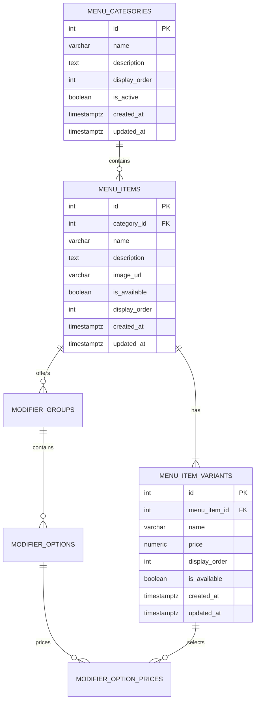

# Menu Database Schema

## Overview

This document defines the initial database schema for the Georgio's Online Ordering menu system.

The schema supports:

* Menu categories
* Menu items
* Item variants such as sizes
* Different prices for each variant
* Item availability
* Display ordering
* Future modifier support such as toppings and add-ons

---

## Menu Categories

The `menu_categories` table represents the main sections of the menu.

Examples:

* Pizza
* Roast Beef
* Hot Subs
* Cold Subs
* Salads
* Side Orders
* Drinks

### Table: `menu_categories`

| Column          | Type      | Constraints            | Description                                  |
| --------------- | --------- | ---------------------- | -------------------------------------------- |
| `id`            | INTEGER   | PRIMARY KEY            | Unique category identifier                   |
| `name`          | VARCHAR   | NOT NULL, UNIQUE       | Category name                                |
| `description`   | TEXT      | NULLABLE               | Optional category description                |
| `display_order` | INTEGER   | NOT NULL               | Controls category display order              |
| `is_active`     | BOOLEAN   | NOT NULL, DEFAULT TRUE | Determines whether the category is displayed |
| `created_at`    | TIMESTAMPTZ | NOT NULL               | Creation timestamp                           |
| `updated_at`    | TIMESTAMPTZ | NOT NULL               | Last update timestamp                        |

---

## Menu Items

The `menu_items` table represents individual food and drink items.

Examples:

* Cheese Pizza
* Super Beef
* Italian Sub
* Caesar Salad

Prices are not stored directly on menu items because many items have multiple sizes with different prices.

### Table: `menu_items`

| Column          | Type      | Constraints            | Description                                |
| --------------- | --------- | ---------------------- | ------------------------------------------ |
| `id`            | INTEGER   | PRIMARY KEY            | Unique menu item identifier                |
| `category_id`   | INTEGER   | NOT NULL, FOREIGN KEY  | Category the item belongs to               |
| `name`          | VARCHAR   | NOT NULL               | Menu item name                             |
| `description`   | TEXT      | NULLABLE               | Optional item description                  |
| `image_url`     | VARCHAR   | NULLABLE               | Optional item image URL                    |
| `is_available`  | BOOLEAN   | NOT NULL, DEFAULT TRUE | Determines whether the item can be ordered |
| `display_order` | INTEGER   | NOT NULL               | Controls display order within the category |
| `created_at`    | TIMESTAMPTZ | NOT NULL               | Creation timestamp                         |
| `updated_at`    | TIMESTAMPTZ | NOT NULL               | Last update timestamp                      |

### Relationship

`menu_items.category_id` references `menu_categories.id` with `ON DELETE CASCADE`.

---

## Menu Item Variants

The `menu_item_variants` table represents purchasable versions of a menu item.

Variants are used for things such as:

* Small
* Medium
* Large
* X-Large
* Regular
* Individual

Each variant has its own price.

### Table: `menu_item_variants`

| Column          | Type           | Constraints            | Description                                   |
| --------------- | -------------- | ---------------------- | --------------------------------------------- |
| `id`            | INTEGER        | PRIMARY KEY            | Unique variant identifier                     |
| `menu_item_id`  | INTEGER        | NOT NULL, FOREIGN KEY  | Menu item the variant belongs to              |
| `name`          | VARCHAR        | NOT NULL               | Variant name                                  |
| `price`         | NUMERIC(10, 2) | NOT NULL, CHECK (price > 0) | Regular price of the variant                  |
| `display_order` | INTEGER        | NOT NULL               | Controls variant display order                |
| `is_available`  | BOOLEAN        | NOT NULL, DEFAULT TRUE | Determines whether the variant can be ordered |
| `created_at`    | TIMESTAMPTZ      | NOT NULL               | Creation timestamp                            |
| `updated_at`    | TIMESTAMPTZ      | NOT NULL               | Last update timestamp                         |

### Relationship

`menu_item_variants.menu_item_id` references `menu_items.id` with `ON DELETE CASCADE`.

### Variant constraints

Variant names must be unique within their parent item. The planned table-level constraint is:

```sql
UNIQUE (menu_item_id, name)
```

For example, Cheese Pizza cannot have two variants named `Large`, but Cheese Pizza and Italian Sub can each have a `Large` variant. Case and whitespace normalization rules remain to be defined.

Every menu item must have at least one variant, including unavailable items. An item with a single price still requires a variant such as `Regular`.

When implemented, item creation must create the item and its initial variant together in one transaction. Deleting or moving the last variant must be rejected if it would leave the original item without a variant. An unavailable variant still counts toward this minimum.

The foreign key alone does not enforce this minimum child count. Database-level enforcement must validate the rule at transaction commit so an item and its first variant can be inserted together. This rule applies only to items that still exist at commit and must allow variants to be deleted when their parent item is deleted. The specific enforcement mechanism remains to be designed; these constraints are proposed, not implemented.

---

## Deletion rules

The planned foreign keys use `ON DELETE CASCADE`:

* Deleting a category deletes all its menu items and, through those items, all their variants.
* Deleting an item deletes all its variants.
* Deleting a variant does not delete its parent item. It must not leave an existing item without a variant.

These are permanent deletions. For temporary unavailability, use the availability flags instead. Cascading deletion is proposed here; it has not yet been implemented in the database.

## Relationships

The initial menu structure is:

```text
MenuCategory
    |
    +-- MenuItem
            |
            +-- MenuItemVariant
```

A menu category can contain many menu items.

Each menu item belongs to one category.

A menu item has one or more variants.

Each variant belongs to one menu item.

---

## Example

A Cheese Pizza would be stored as one menu item:

```text
menu_items

id: 1
category_id: 1
name: Cheese Pizza
```

Its sizes and prices would be stored as variants:

```text
menu_item_variants

id | menu_item_id | name     | price
---|--------------|----------|------
1  | 1            | Small    | 10.85
2  | 1            | Large    | 14.95
3  | 1            | X-Large  | 20.75
```

An item with only one price will still have one variant, such as `Regular`.

---

## Pricing

Prices will use PostgreSQL's `NUMERIC(10, 2)` type.

```text
NUMERIC(10, 2)
```

Floating-point types should not be used for monetary values because they can introduce rounding errors.

Variant prices represent regular menu prices and must be strictly positive. The planned database constraint is:

```sql
CHECK (price > 0)
```

Zero and negative regular prices are not allowed. Future coupons and buy-one-get-one offers will apply discounts separately from stored menu prices and may reduce the amount charged to zero. Discount modeling is outside this initial menu schema and has not been implemented.

---

## Availability

Categories, menu items, and individual variants can be disabled without deleting them.

The schema uses:

```text
menu_categories.is_active
menu_items.is_available
menu_item_variants.is_available
```

This allows Georgio's to temporarily hide an item or size while preserving its database record.

---

## Timestamps

All three tables will use PostgreSQL `TIMESTAMPTZ` for `created_at` and `updated_at`. Timestamps will be managed by the database:

* On insert, both fields default to `CURRENT_TIMESTAMP`.
* `created_at` records creation time and must remain unchanged on later updates.
* A database update trigger will automatically refresh `updated_at` when the row is updated. Application code will not need to supply these timestamps.

Timezone-aware values represent an unambiguous instant; display formatting can use the restaurant's local timezone. These fields record creation and last-update times, not a history of changes or who made them.

Updates refresh only the changed row's `updated_at`; they do not propagate to parent records. For example, changing a variant's price updates that variant's timestamp but leaves its menu item's and category's timestamps unchanged. Changing the item's description updates only the item's timestamp.

Defaults and triggers are planned here and have not yet been implemented.

---

## Display Ordering

Categories, items, and variants use `display_order` fields so the menu can be displayed in a specific order without relying on database IDs or creation time.

Display positions must be unique within the list being ordered. The planned database constraints are:

| Table | Unique constraint | Scope |
| --- | --- | --- |
| `menu_categories` | `UNIQUE (display_order)` | All categories |
| `menu_items` | `UNIQUE (category_id, display_order)` | Items within the same category |
| `menu_item_variants` | `UNIQUE (menu_item_id, display_order)` | Variants within the same item |

For example, Cheese Pizza and Italian Sub can both have position `1` if they belong to different categories. Two items in the same category cannot share position `1`. Unavailable records still reserve their positions.

Queries must explicitly sort by `display_order` in ascending order; uniqueness does not automatically sort query results. Positions do not need to be consecutive.

Reordering must preserve these constraints. Swapping occupied positions requires either temporary unused positions or deferring the unique constraints within a transaction; the implementation approach remains to be chosen. These constraints are proposed here and have not yet been implemented in the database.

---

## Design Decision: Variants

Menu item prices will be stored on variants rather than directly on `menu_items`.

This allows the schema to represent items with multiple sizes and prices consistently.

Every menu item will have at least one variant.

For example:

```text
Cheese Pizza
|
+-- Small
+-- Large
+-- X-Large
```

---

## Modifier Support (GEO-20)

Modifier groups belong to a specific menu item, not a global reusable catalog. Variants represent the purchasable size; modifiers customize that purchase. For example, Cheese Pizza's Toppings group contains Pepperoni, with adjustments of 1.30 for Small/Large and 1.50 for X-Large.

### `modifier_groups`

| Column | Type | Constraints / meaning |
| --- | --- | --- |
| `id` | INTEGER | Primary key |
| `menu_item_id` | INTEGER | NOT NULL; FK to menu_items.id, ON DELETE CASCADE |
| `name` | VARCHAR | NOT NULL; unique within item |
| `min_selections` | INTEGER | NOT NULL; >= 0 |
| `max_selections` | INTEGER | NOT NULL; >= 0 and >= min_selections |
| `display_order` | INTEGER | NOT NULL; unique within item |
| `is_active` | BOOLEAN | NOT NULL; server default true |
| `created_at` | TIMESTAMPTZ | NOT NULL; server default now() |
| `updated_at` | TIMESTAMPTZ | NOT NULL; server default now(); database update trigger |

### `modifier_options`

| Column | Type | Constraints / meaning |
| --- | --- | --- |
| `id` | INTEGER | Primary key |
| `modifier_group_id` | INTEGER | NOT NULL; part of composite group FK |
| `menu_item_id` | INTEGER | NOT NULL; ownership matches group |
| `name` | VARCHAR | NOT NULL; unique within group |
| `display_order` | INTEGER | NOT NULL; unique within group |
| `is_available` | BOOLEAN | NOT NULL; server default true |
| `created_at` | TIMESTAMPTZ | NOT NULL; server default now() |
| `updated_at` | TIMESTAMPTZ | NOT NULL; server default now(); database update trigger |

### `modifier_option_prices`

| Column | Type | Constraints / meaning |
| --- | --- | --- |
| `id` | INTEGER | Primary key |
| `modifier_option_id` | INTEGER | NOT NULL; part of composite option FK |
| `menu_item_variant_id` | INTEGER | NOT NULL; part of composite variant FK |
| `menu_item_id` | INTEGER | NOT NULL; shared ownership key |
| `price_adjustment` | NUMERIC(10, 2) | NOT NULL; CHECK (price_adjustment >= 0); Python Decimal |

The (modifier_option_id, menu_item_variant_id) pair is unique. Zero represents a free choice; negative adjustments are rejected. The pricing table has no timestamps in this ticket. No default price adjustment or selection limits are assumed; callers must supply them. Selection bounds describe allowed counts; validating customer selections is future ordering work. A missing price row is not automatically a free choice.

### Same-item ownership enforced by PostgreSQL

`menu_item_id` is deliberately duplicated in options and prices to make item ownership part of each foreign key. All three composite foreign keys use ON DELETE CASCADE:

| Child key | Referenced key |
| --- | --- |
| modifier_options(modifier_group_id, menu_item_id) | modifier_groups(id, menu_item_id) |
| modifier_option_prices(modifier_option_id, menu_item_id) | modifier_options(id, menu_item_id) |
| modifier_option_prices(menu_item_variant_id, menu_item_id) | menu_item_variants(id, menu_item_id) |

Each referenced (id, menu_item_id) pair has a composite UNIQUE constraint. One price row must satisfy both the option and variant ownership keys, so Pepperoni belonging to Cheese Pizza cannot be priced against an Italian Sub variant, even through direct SQL. Ownership changes that invalidate existing references are rejected; no ON UPDATE CASCADE is configured.

The ORM option relationship supplies the price row's ownership value. The variant relationship joins on both columns but writes only the variant ID, avoiding competing writes to menu_item_id. Database constraints remain the authority for ownership; this is not application-only validation.

Deleting an item cascades through its groups/options/prices and its variants. Deleting a group deletes its options/prices; deleting an option or variant deletes the affected prices. Disabling availability does not delete records or release unique names/display positions. Order lists explicitly by display_order; uniqueness is scoped to the parent list.

### Migration

Revision `9e4f00aee08d` follows `361f81bb87ba`. It adds the variant composite key before the new pricing foreign key, creates the modifier tables, and adds update triggers for groups/options using the existing set_updated_at() function. Updates change only the affected row's timestamp. Downgrade removes modifier triggers, child tables, and finally the variant composite key; it preserves the function used by existing menu tables.

The migration was applied and checked locally for GEO-20. PostgreSQL integration checks can be rerun from backend/ with `GEO20_DB_TESTS=1 uv run pytest tests/test_modifiers.py`; they require the migrated development database and roll back their test rows. The initial minimum-one-variant-per-item requirement remains outside this modifier implementation.

---

## Entity Relationship Diagram



## Current Schema Summary

The menu system contains three core tables plus three modifier tables:

```text
menu_categories
    |
    +-- menu_items
            |
            +-- menu_item_variants
            +-- modifier_groups
                    +-- modifier_options
                            +-- modifier_option_prices (also references a variant)
```

GEO-20 adds modifier_groups, modifier_options, and modifier_option_prices, with composite foreign keys enforcing the same menu item throughout the modifier pricing path.
